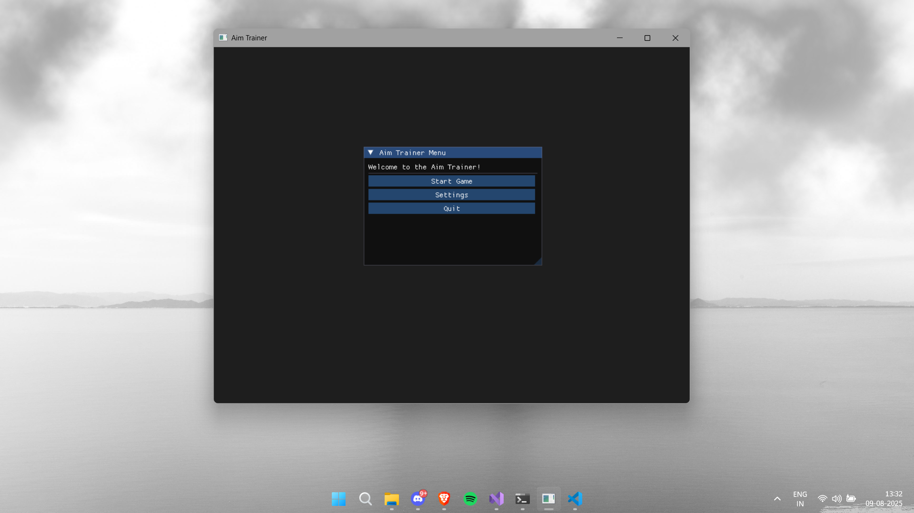
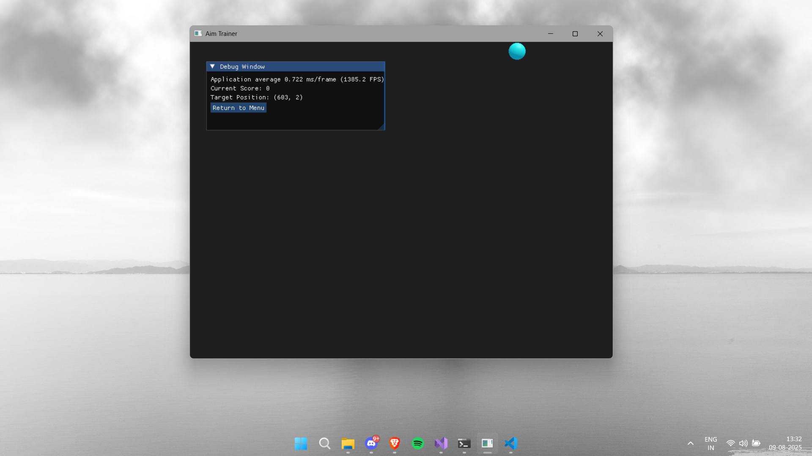

# 🎯 SDL2 Aim Trainer

A lightweight aim training game built using **SDL2** and **C++**. Inspired by games like **Aim Labs**, this trainer helps you improve your reaction time and precision by clicking on fast-moving targets.

---

## 🛠️ Features

- 🔴 Randomly spawning targets
- 🖱️ Mouse click detection with scoring
- 🎮 Smooth 60 FPS gameplay using SDL2
- 🎯 Scalable structure for future modes (reaction, tracking, speed)
- 🧱 Modular C++ code with clear separation (Target, Game loop, etc.)

---

## 📸 Screenshots

**Startup Screen**  


**Debug Window**  


---

## 🚀 Getting Started

### Prerequisites

- [Visual Studio](https://visualstudio.microsoft.com/)
- [SDL](https://github.com/libsdl-org/SDL/releases)

> ✅ SDL2 should be configured with include/lib paths in your Visual Studio project.

---

## 🧑‍💻 Building

1. Clone the repository:
    ```bash
    git clone https://github.com/cyruswastaken/Trainer.git
    ```

2. Open `Trainer.sln` in Visual Studio.

3. Make sure `SDL2.dll` is in the same directory as your `Release/` or `Debug/` output.

4. Build and run (`Ctrl + F5`).

---

## 🎮 Controls

| Action            | Input               |
|------------------|---------------------|
| Click target      | Left Mouse Button   |
| Exit game         | Close window (X)    |

---

## ✅ Upcoming features

- ⏱️ Countdown timer mode
- 📊 Accuracy and time-based score system
- 🔇 Sound effects using SDL_mixer
- ✍️ Score display using SDL_ttf
- 🎯 Multiple training modes (flick, tracking)

---

## 📝 License

This project is licensed under the MIT License - see the [LICENSE](LICENSE) file for details.
